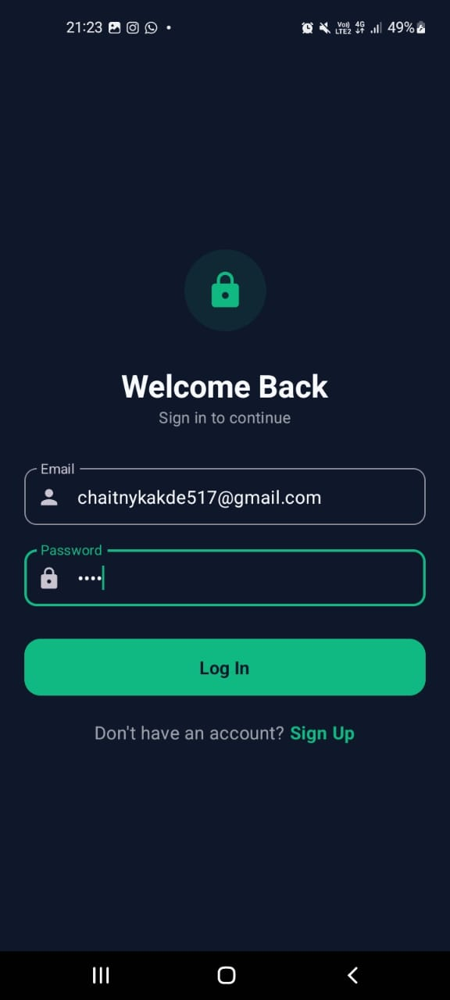
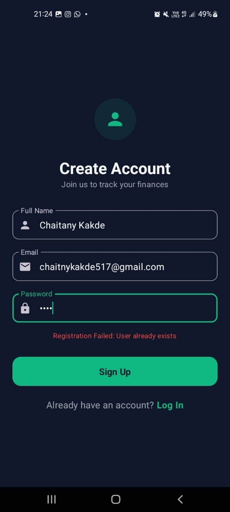
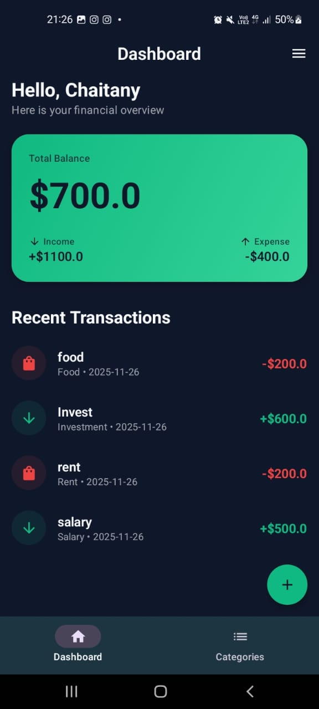
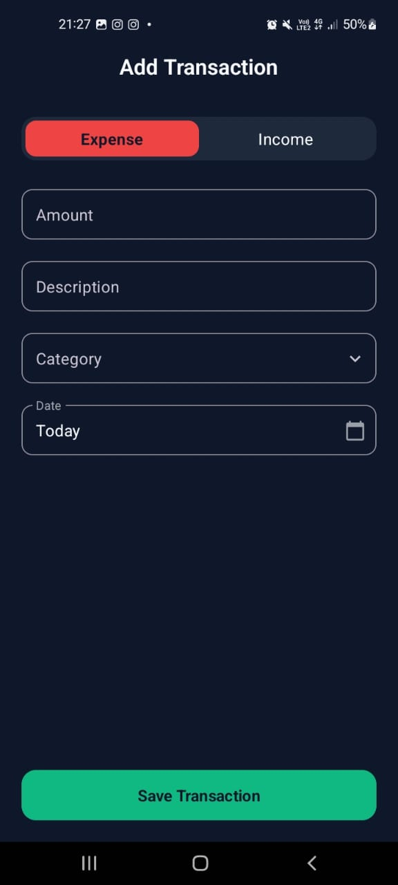
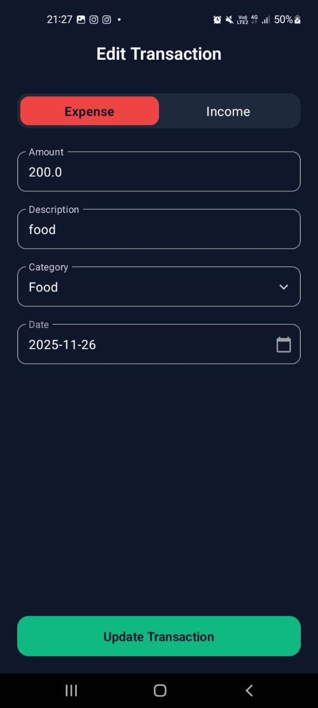
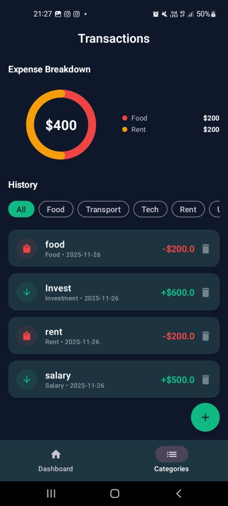
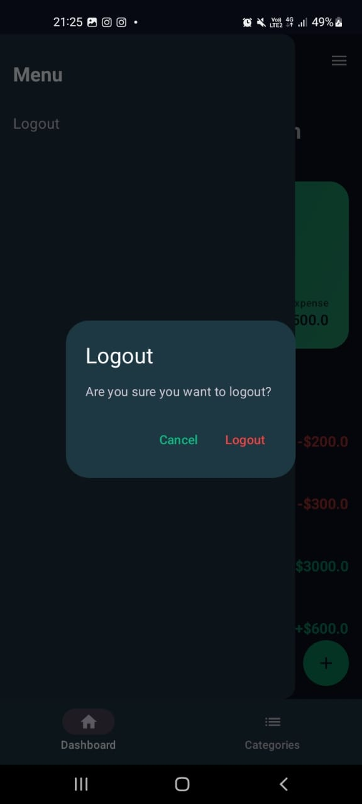

# VivaahVerse Expense Tracker

A **Premium Fintech-styled** Expense Tracker application built with **Jetpack Compose** (Android) and **Node.js/Express** (Backend). This app offers a modern, dark-themed UI ("Midnight Emerald") to manage your personal finances efficiently.

## 📱 Download App
**[Download Latest APK (Debug)](ExpenseTracker.apk)**

---

## ✨ Features

*   **Authentication**: Secure Login & Registration (JWT-based) with persistent session.
*   **Dashboard**: Glassmorphism-styled balance card, income/expense breakdown, and recent transactions.
*   **Transactions**: Add Income or Expenses with categories and dates.
*   **Analytics**: Visual breakdown of expenses by category using a dynamic Donut Chart.
*   **Premium UI**: "Midnight Emerald" Dark Theme with fully rounded shapes and smooth animations.
*   **Error Handling**: User-friendly feedback for login/registration errors (e.g., "User already exists").

---

## 📸 Screenshots

| Login Screen | Registration Screen |
|:---:|:---:|
|  |  |

| Dashboard | Add Transaction |
|:---:|:---:|
|  |  |

| Transaction List | Expense Breakdown |
|:---:|:---:|
|  |  |

| Logout Dialog |
|:---:|
|  |

---

## 🛠 Tech Stack

**Android (Frontend)**
*   **Language**: Kotlin
*   **UI Framework**: Jetpack Compose (Material 3)
*   **Architecture**: MVVM (Model-View-ViewModel)
*   **DI**: Hilt (Dagger)
*   **Networking**: Retrofit + OkHttp
*   **Local Storage**: DataStore Preferences
*   **Async**: Coroutines & Flow

**Backend**
*   **Runtime**: Node.js
*   **Framework**: Express.js
*   **Database**: Firebase Realtime Database
*   **Deployment**: Render
*   **Auth**: JWT (JSON Web Tokens)

---

## 🚀 Setup Instructions

1.  **Clone the repository**:
    ```bash
    git clone https://github.com/chaitanykakde/VivaahVerse-Chaitnay-Task.git
    ```
2.  **Open in Android Studio**: Select the `VivaahVerseChaitany` folder.
3.  **Sync Gradle**: Allow dependencies to download.
4.  **Run**: Connect a device or start an emulator and click "Run".

**Backend Setup (Optional)**
If you want to run the backend locally:
1.  Navigate to `backend/` folder.
2.  Run `npm install`.
3.  Run `npm run dev`.
4.  Update `BASE_URL` in `AppModule.kt` to `http://10.0.2.2:3000/`.

---

## 👤 Author
**Chaitany Kakde**
